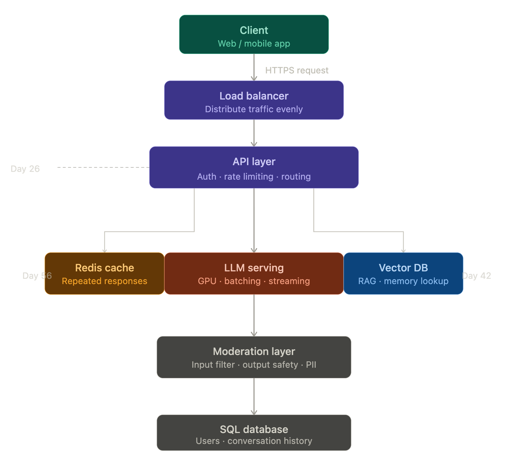
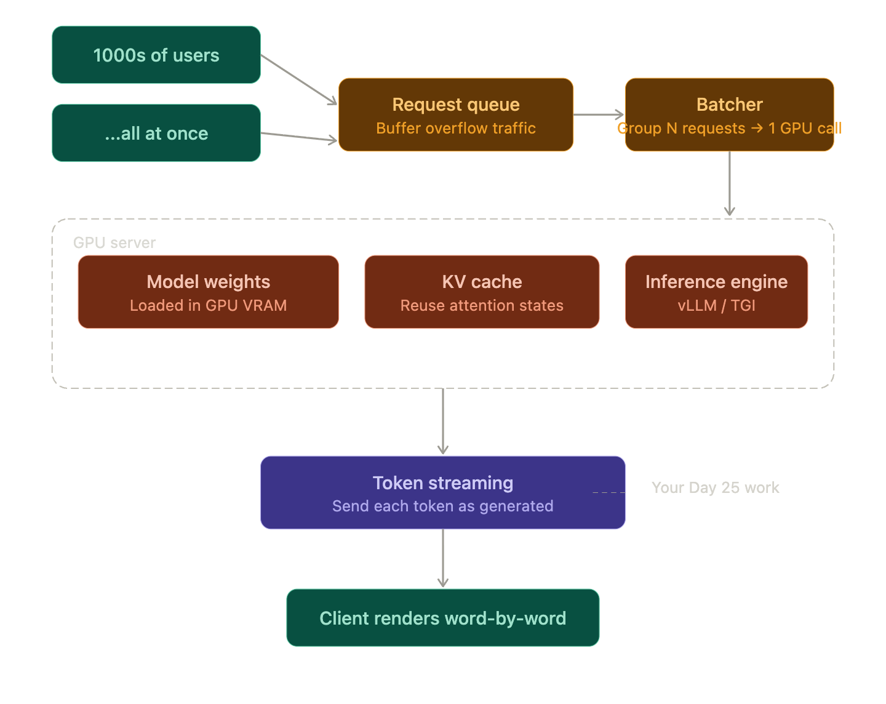
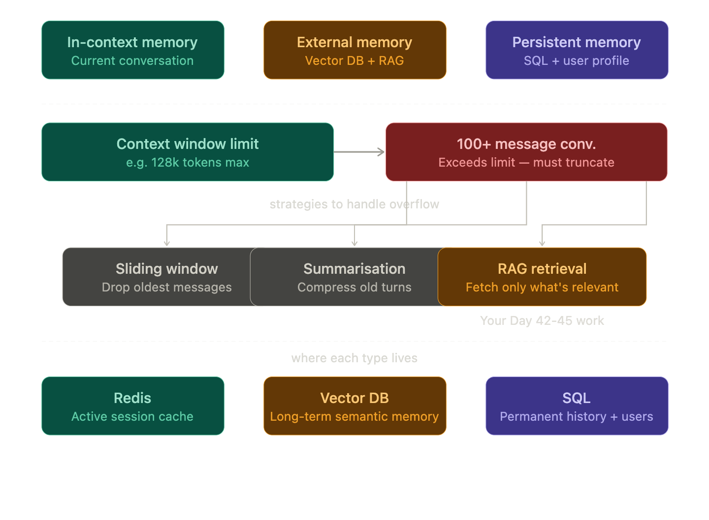
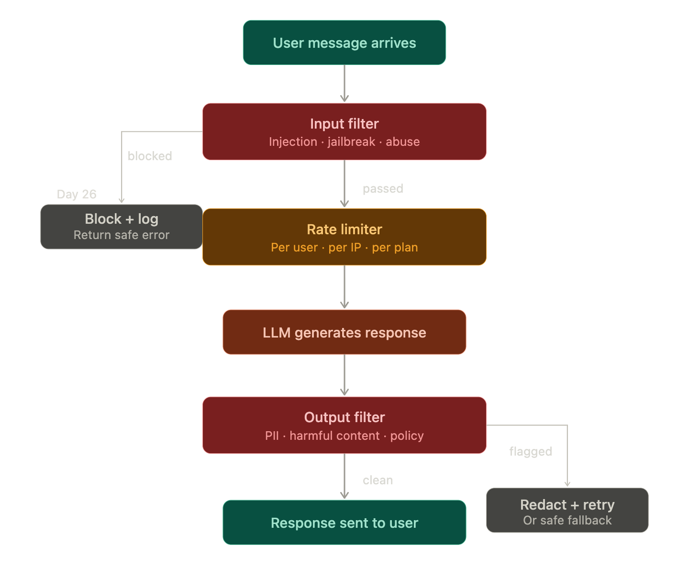
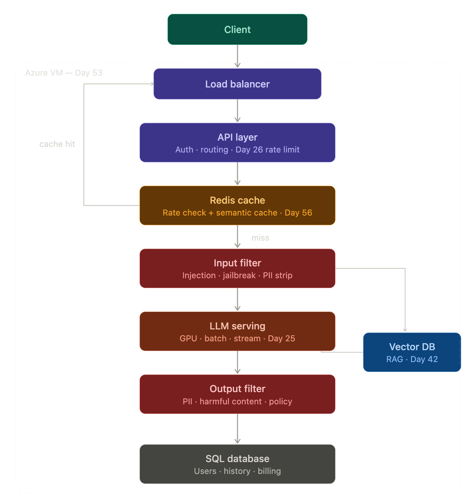

###### Phase 2: High-Level Architecture

###### Phase 3: The LLM Serving Layer

###### Phase 4: Memory & Context Management

###### Phase 5: Safety & Moderation Layer

###### Phase 6: Reflection — You Just Designed ChatGPT

* If needed for correct images/svg open Day 68 in claude ai chats